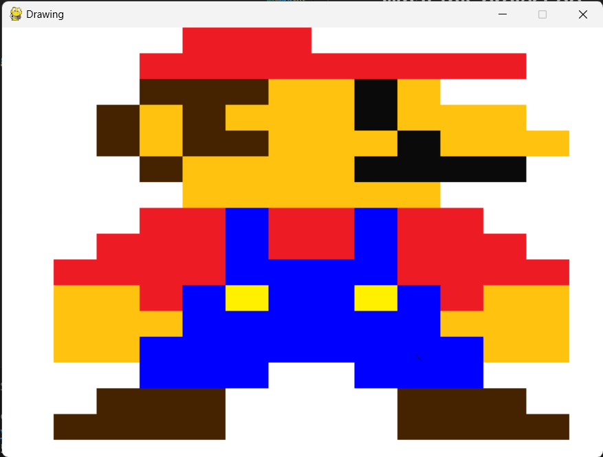

# pygame-graw_basic

## What this project do
This project is a fun demonstration of the Pygame library in Python. It creates a graphical window and uses basic drawing operations to create a simple representation of the iconic character Mario. The background of the window is set to white, and various shapes and colors are used to depict Mario. This project serves as a basic introduction to game character rendering using Pygame.

### Dependencies
- Python 3.11.5
- Pygame 2.5.2
## How to run this project
1. Clone this repository using 
```git
git clone https://github.com/pakin6509681182/pygame-draw_basic.git
```
2. Install Pygame using
```python
python -m pip install -U pygame --user
```
3. Run the project using
```python
python draw_basic.py
```